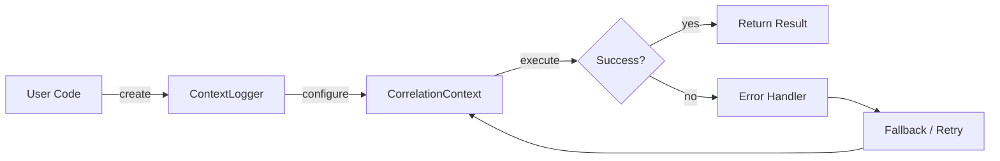
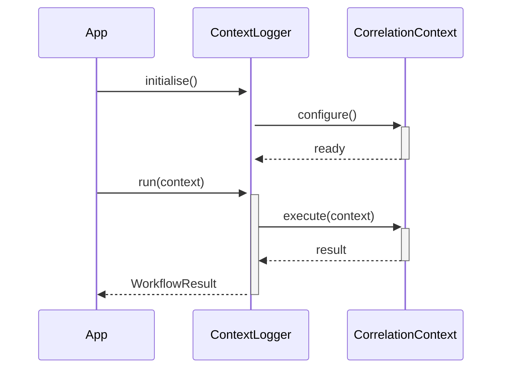

<div align="center">

</div>

# agent-logger

**Structured JSON logging for LLM agents — correlation IDs, context binding, sampling, and redaction.**

[](https://pypi.org/project/agent-logger/) [](https://python.org) [](LICENSE) [](#)

---

## The Problem

Without a structured logger, context propagation requires manual threading through every function call. Correlation IDs get lost; log lines from different agents interleave with no way to reconstruct a single request's journey.

## Installation

```bash
pip install agent-logger
```

## Quick Start

```python
from agent_logger import ContextLogger, CorrelationContext, _JSONFormatter

# Initialise
instance = ContextLogger(name="my_agent")

# Use
# see API reference below
print(result)
```

## API Reference

### `ContextLogger`

```python
class ContextLogger:
    """Logger that merges a fixed set of fields into every log line.
    def __init__(self, parent: "AgentLogger", **fields: Any) -> None:
    def bind(self, **kwargs: Any) -> "ContextLogger":
        """Return a new ContextLogger with additional bound fields."""
    def _emit(self, level: str, message: str, **kwargs: Any) -> None:
    def debug(self, message: str, **kwargs: Any) -> None:
```

### `CorrelationContext`

```python
class CorrelationContext:
    """Thread-local correlation ID manager.
    def set(cls, id: str) -> None:
        """Set correlation ID for the current thread."""
    def get(cls) -> Optional[str]:
        """Get correlation ID for the current thread. Returns None if not set."""
    def generate(cls) -> str:
        """Generate a new UUID4 correlation ID (does NOT set it)."""
    def clear(cls) -> None:
        """Clear the correlation ID for the current thread."""
```

### `_JSONFormatter`

```python
class _JSONFormatter(logging.Formatter):
    """Formats a LogRecord as a JSON string."""
    def format(self, record: logging.LogRecord) -> str:
```

### `AgentLogger`

```python
class AgentLogger:
    """Structured JSON logger for LLM agents.
    def __init__(
```


## How It Works

### Flow



### Sequence



## Philosophy

> Chitragupta records every deed in Yama's court; a structured logger is the production equivalent of that perfect witness.

---

*Part of the [arsenal](https://github.com/darshjme/arsenal) — production stack for LLM agents.*

*Built by [Darshankumar Joshi](https://github.com/darshjme), Gujarat, India.*
